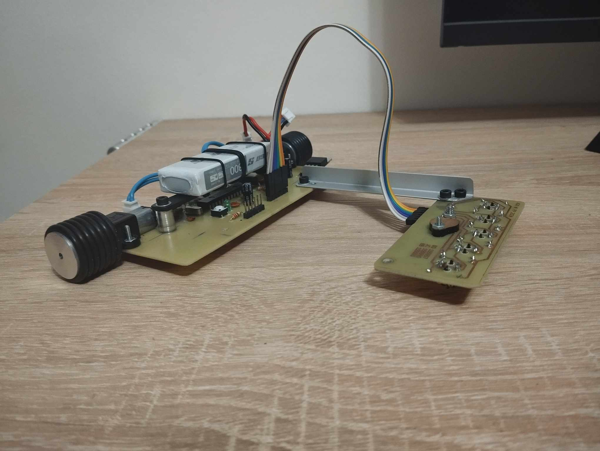

# Line Follower Robot  

  

## Overview  
This repository contains the project of a Line Follower Robot developed as part of the Computer Systems Architecture course at the Poznan University of Technology. The robot is designed to autonomously follow a black line on a flat surface using embedded sensors and self-developed control logic. The project involved designing, assembling, and programming the robot from scratch.  

**We managed to create an autonomous system that can follow the line at a speed of approximately 1 m/s**  
We won a competition outperforming 10 other teams with our creation of a lightweight robot featuring an efficient drive system.  

## Team Members  
1. Hubert Błaszczyk - 155085
- PCB etching
- Software development
- Video production
- System testing and calibration

2. Bartosz Operacz - 155957
- PCB etching
- Software development
- Documentation preparation
- System testing and calibration

3. **I was responible for:**
- PCB etching
- Robot design
- Component assembly
- System testing and calibration  

## Project Goal
The objective of the project was to develop a robot capable of autonomously tracking a black line by:

- Detecting a black line beneath it  
- Operating on a flat surface with the ability to steer and adjust speed  
- Being self-powered  
- Generating signals to follow the line accurately  
- Indicating correct operation through LEDs  
- Allowing easy reprogramming for improvements or troubleshooting  

## Technical Specifications
- Sensors: 5 TCRT5000 optical sensors to detect line position.
- Motors: 2 N20-BT16 motors with 2000 rpm, allowing ~2 m/s speed.
- Motor Driver: TB6612FNG for dual-channel motor control.
- Power Source: 2S 7.4V Li-Pol battery.
- Voltage Regulator: LM7805 with reverse current protection.
- Microcontroller: ATMEGA328P-PN, 16MHz clock.
- Other Features: Custom PCB with solder mask, LED indicators, programmable SPI interface.

## Software Overview
The software was developed to:  

Read sensor signals to determine the robot's position relative to the line.
Control motor speed and direction based on a PID (Proportional-Integral-Derivative) controller.
Use LEDs to signal operational status and low battery levels.
Key Functions:

drive_motors: Controls motor speed and direction.
calibrate: Calibrates the sensors for line detection.
calculate_error: Calculates deviation from the line.
PID control: Adjusts motor speed to correct positioning.
Assembly and Etching
The PCB etching process was completed in-house, following these steps:

Preparing film layouts.
UV exposure and etching.
Drilling and mounting components.
Final soldering and assembly.

## Budget Summary
The total cost for the project components was approximately 404.53 PLN.

## Demo Video
A video demonstration of the Line Follower Robot is available on YouTube:  
[result](https://youtu.be/YW8YQgWOzjk)  
[project video](https://www.youtube.com/watch?v=wPkWPQ8s4SI&ab_channel=NapewnonieHubert)  

## Notes
Capacitor C5 was removed due to programming issues.  
The footprint for LM7805 was incorrectly sized, requiring adjustments.

### Project documentation is available in polish
